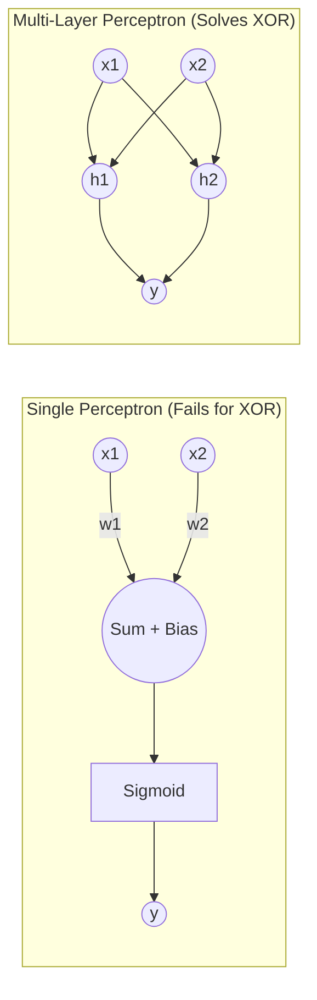
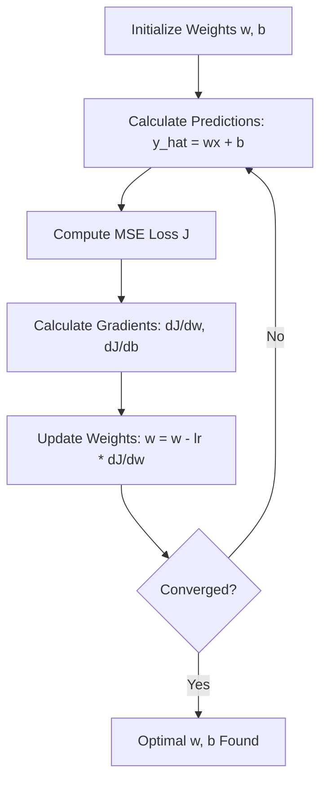

# Module I: Deep Learning Introduction - Question Bank

## Q1. Differentiate between McCulloch-Pitts (MP) Neuron and Sigmoid Perceptron.

**Answer:**

Both MP Neuron and Sigmoid Perceptron are simplified mathematical models of biological neurons, but they differ significantly in their capabilities and underlying mathematics.

| Feature | McCulloch-Pitts (MP) Neuron | Sigmoid Perceptron |
| :--- | :--- | :--- |
| **Inputs** | Only Boolean inputs (0 or 1). | Real-valued inputs ($x \in \mathbb{R}$). |
| **Weights** | Fixed weights, no learning algorithm initially. Excitatory (+1) or Inhibitory (-1). | Learnable weights ($w \in \mathbb{R}$) allowing for continuous adjustments. |
| **Output** | Boolean output (0 or 1). | Continuous output between 0 and 1 (represents probability). |
| **Activation Function** | Hard thresholding logic. Output is 1 if sum $\ge$ threshold $\theta$, else 0. | Smooth, differentiable Sigmoid function: $y = \frac{1}{1 + e^{-w^Tx}}$. |
| **Decision Boundary** | Linear, but highly restricted due to discrete inputs/weights. | Linear, capable of separating linearly separable continuous data. |
| **Learning** | Cannot learn from data (weights and threshold are hand-coded). | Learns from data using optimization algorithms like Gradient Descent. |
| **Differentiability** | Non-differentiable (step function), hindering backpropagation. | Differentiable everywhere, enabling gradient-based learning. |

---

## Q2. Implement OR, AND, NOT, XOR function by Sigmoid Perceptron. Comment on XOR function implementation.

**Answer:**

A single Sigmoid Perceptron takes inputs $x_1, x_2$, applies weights $w_1, w_2$ and bias $b$, and outputs $y = \sigma(w_1x_1 + w_2x_2 + b)$. For logic gates, we consider output $y \ge 0.5$ as 1, and $y < 0.5$ as 0. This implies $w_1x_1 + w_2x_2 + b \ge 0$ for output 1.

**1. AND Function:**
Truth table: (0,0)->0, (0,1)->0, (1,0)->0, (1,1)->1
Let $w_1 = 1$, $w_2 = 1$, $b = -1.5$
* (0,0): $0 + 0 - 1.5 = -1.5 \implies y < 0.5 \implies 0$
* (1,0): $1 + 0 - 1.5 = -0.5 \implies y < 0.5 \implies 0$
* (1,1): $1 + 1 - 1.5 = +0.5 \implies y \ge 0.5 \implies 1$

**2. OR Function:**
Truth table: (0,0)->0, (0,1)->1, (1,0)->1, (1,1)->1
Let $w_1 = 1$, $w_2 = 1$, $b = -0.5$
* (0,0): $0 + 0 - 0.5 = -0.5 \implies y < 0.5 \implies 0$
* (1,0): $1 + 0 - 0.5 = +0.5 \implies y \ge 0.5 \implies 1$
* (1,1): $1 + 1 - 0.5 = 1.5 \implies y \ge 0.5 \implies 1$

**3. NOT Function:**
Truth table: (0)->1, (1)->0
Let $w_1 = -1$, $b = 0.5$
* (0): $0 + 0.5 = 0.5 \implies y \ge 0.5 \implies 1$
* (1): $-1 + 0.5 = -0.5 \implies y < 0.5 \implies 0$

**4. XOR Function:**
Truth table: (0,0)->0, (0,1)->1, (1,0)->1, (1,1)->0
**Comment on XOR:** A single Sigmoid Perceptron **cannot** implement the XOR function. XOR is not linearly separable. You cannot draw a single straight line on a 2D plane to separate the (0,0) and (1,1) class from the (0,1) and (1,0) class. To implement XOR, we require a Multi-Layer Perceptron (MLP) with at least one hidden layer to project the inputs into a linearly separable space.

---

## Q3. Show mathematically that Perceptron can learn AND function.

**Answer:**

Let's trace the Perceptron Learning Algorithm for the AND function.
Inputs: $X_1 = [0, 0], X_2 = [0, 1], X_3 = [1, 0], X_4 = [1, 1]$
Labels: $Y_1 = 0, Y_2 = 0, Y_3 = 0, Y_4 = 1$

Let's initialize weights $w = [0, 0]$ and bias $b = 0$. Learning rate $\eta = 1$.
Prediction rule: $\hat{y} = 1$ if $w^Tx + b \ge 0$, else $0$.
Update rule: If mistake, $w_{new} = w_{old} \pm \eta x$ (add if true class is 1, subtract if true class is 0).

**Epoch 1:**
* $X_1(0,0), Y=0$: $0\cdot0 + 0\cdot0 + 0 = 0 \ge 0 \implies \hat{y} = 1$ (Mistake!). $w = w - x = [0,0] - [0,0] = [0,0], b = 0 - 1 = -1$.
* $X_2(0,1), Y=0$: $0\cdot0 + 0\cdot1 - 1 = -1 < 0 \implies \hat{y} = 0$ (Correct).
* $X_3(1,0), Y=0$: $0\cdot1 + 0\cdot0 - 1 = -1 < 0 \implies \hat{y} = 0$ (Correct).
* $X_4(1,1), Y=1$: $0\cdot1 + 0\cdot1 - 1 = -1 < 0 \implies \hat{y} = 0$ (Mistake!). $w = w + x = [0,0] + [1,1] = [1,1], b = -1 + 1 = 0$.

**Epoch 2:**
* $X_1(0,0), Y=0$: $1\cdot0 + 1\cdot0 + 0 = 0 \ge 0 \implies \hat{y} = 1$ (Mistake!). $w = [1,1] - [0,0] = [1,1], b = 0 - 1 = -1$.
* $X_2(0,1), Y=0$: $1\cdot0 + 1\cdot1 - 1 = 0 \ge 0 \implies \hat{y} = 1$ (Mistake!). $w = [1,1] - [0,1] = [1,0], b = -1 - 1 = -2$.
* $X_3(1,0), Y=0$: $1\cdot1 + 0\cdot0 - 2 = -1 < 0 \implies \hat{y} = 0$ (Correct).
* $X_4(1,1), Y=1$: $1\cdot1 + 0\cdot1 - 2 = -1 < 0 \implies \hat{y} = 0$ (Mistake!). $w = [1,0] + [1,1] = [2,1], b = -2 + 1 = -1$.

This process repeats until convergence. For brevity, a known convergence point for AND is $w = [1, 1], b = -1.5$.
Verification:
* $X(1,1) \implies 1(1) + 1(1) - 1.5 = 0.5 > 0 \implies 1$ (Correct)
* $X(0,1) \implies 1(0) + 1(1) - 1.5 = -0.5 < 0 \implies 0$ (Correct)
This mathematical trace proves the perceptron eventually learns a weight/bias combination to satisfy the AND function.

---

## Q4. How can you be sure that Perceptron algorithm has finally converged?

**Answer:**

We can be sure that the Perceptron algorithm has converged when it passes through the entire training dataset without making a single mistake.

Mathematically, this is guaranteed by the **Perceptron Convergence Theorem**. The theorem states that if the training dataset is **linearly separable** (i.e., there exists a hyperplane that perfectly separates the positive and negative examples), the perceptron learning algorithm is guaranteed to find such a separating hyperplane in a finite number of steps (updates).

* **Convergence Condition:** The error rate drops to $0$ over the training set.
* **Non-Separable Case:** If the data is not linearly separable (e.g., XOR), the perceptron will never converge; the weights will oscillate indefinitely. In practical implementations, we use a maximum number of epochs or a tolerance limit to prevent infinite loops.

---

## Q5. Argue that two layers of Perceptron can learn any function of any dimensionality.

**Answer:**

This concept refers to the **Universal Approximation Theorem** for Multilayer Perceptrons (MLPs).

A two-layer perceptron (one hidden layer and one output layer) can approximate any continuous function given a sufficient number of hidden neurons.

**Argument:**
1. **Building Blocks:** A single perceptron can draw a single decision boundary (a hyperplane).
2. **Hidden Layer (Forming Convex Polygons):** A hidden layer with multiple perceptrons can draw multiple intersecting lines. By passing these through a non-linear activation (like step or sigmoid), their intersections can be AND-ed together by the next layer to form closed, convex regions (like polygons or hyperspheres) in the input space.
3. **Output Layer (Combining Regions):** The output layer can perform an OR operation on the outputs of the hidden layer. This allows the network to combine multiple disconnected convex regions together.
4. **Conclusion:** By combining arbitrarily small, distinct convex regions, a two-layer network can map out complex, highly non-linear decision boundaries matching any mathematical function. The wider the hidden layer, the more granular and precise the approximation becomes.

---

## Q6. What is loss function? Why is it used? What is the loss function used in Regression? Explain Gradient Descent technique, taking Regression as an example.

**Answer:**

**Loss Function:**
A loss function $L(y, \hat{y})$ is a mathematical formula that quantifies the difference between the actual true value ($y$) and the predicted value ($\hat{y}$) produced by the model for a single training example.
**Why is it used?** It acts as a guide for the model during training. The goal of any machine learning algorithm is to minimize this loss. It tells the optimizer how "wrong" the model is, providing the gradients needed to update the weights.

**Loss Function in Regression:**
The most common loss function for regression is **Mean Squared Error (MSE)** or Squared Error for a single instance:
$L(y, \hat{y}) = \frac{1}{2}(y - \hat{y})^2$
For a dataset of $N$ points, the cost function is $J(w, b) = \frac{1}{2N} \sum_{i=1}^{N} (y_i - \hat{y}_i)^2$

**Gradient Descent (GD) Technique with Regression:**
Gradient descent is an iterative optimization algorithm used to find the minimum of a function.
1. **Initialization:** Start with random parameters (weights $w$ and bias $b$). Let $\hat{y} = wx + b$.
2. **Compute Loss:** Calculate the total error $J(w, b)$ over the training data.
3. **Calculate Gradients:** Determine the partial derivative of the loss function with respect to each parameter. This tells us the direction of steepest ascent.
   * $\frac{\partial J}{\partial w} = -\frac{1}{N} \sum_{i=1}^N x_i (y_i - (w x_i + b))$
   * $\frac{\partial J}{\partial b} = -\frac{1}{N} \sum_{i=1}^N (y_i - (w x_i + b))$
4. **Update Parameters:** Move opposite to the gradient by a step size defined by the learning rate ($\eta$).
   * $w_{new} = w_{old} - \eta \frac{\partial J}{\partial w}$
   * $b_{new} = b_{old} - \eta \frac{\partial J}{\partial b}$
5. **Iterate:** Repeat steps 2-4 until the gradients are close to zero (convergence), meaning we have reached the global minimum of the convex MSE error surface.

