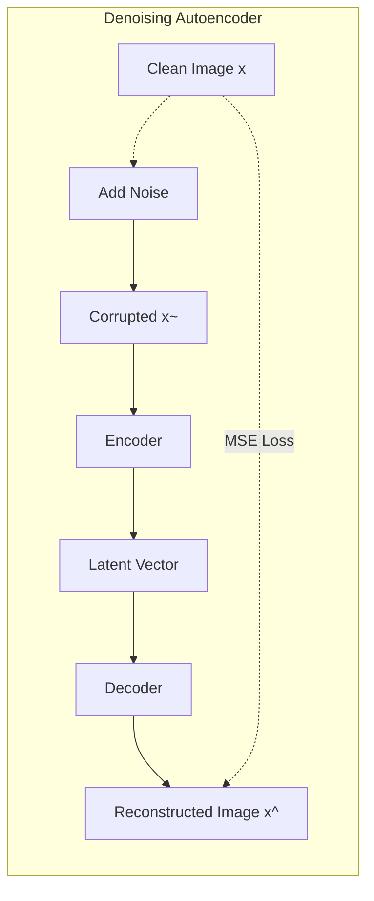

# Module III: Autoencoders - Question Bank

## Q1. Explain the relationship between Autoencoders & PCA.

**Answer:**

Both Principal Component Analysis (PCA) and Autoencoders are used for dimensionality reduction and representation learning. 

If an Autoencoder is strictly **linear** (using a linear activation function in the hidden layers) and trained using Mean Squared Error (MSE), the subspace spanned by the hidden weights is mathematically equivalent to the principal subspace spanned by the top principal components in PCA. 

**Key differences:**
1. **Orthogonality:** PCA strictly forces the principal components (eigenvectors) to be orthogonal to each other. A Linear Autoencoder does not enforce orthogonality among its weight vectors.
2. **Non-linearity:** PCA is strictly a linear transformation technique. Autoencoders, by introducing non-linear activation functions (like Sigmoid, ReLU), can capture highly complex, non-linear manifolds in the data, making them far more powerful for complex data like images.

---

## Q2. Is PCA a lossless or lossy compression technique? Explain.

**Answer:**

PCA is inherently a **lossy compression technique**. 

**Explanation:**
When PCA transforms data from a higher dimension $D$ to a lower dimension $K$ (where $K < D$), it projects the data points onto the top $K$ eigenvectors that capture the maximum variance. The variance associated with the remaining $D-K$ eigenvectors is discarded.
When reconstructing the original data from the $K$-dimensional representation, the discarded information cannot be recovered. This results in reconstruction error. It is only "lossless" if we keep $K = D$ dimensions, but then it ceases to be a dimensionality reduction technique.

---

## Q3. Give applications of Autoencoders. Explain them.

**Answer:**

1. **Dimensionality Reduction & Visualization:** Autoencoders with a bottleneck layer force the network to learn a compressed representation (latent space) of the input. This lower-dimensional data is easier to process and can be visualized (using t-SNE or PCA on the latent space).
2. **Image Denoising:** Denoising Autoencoders are trained by intentionally corrupting input images with noise and forcing the network to reconstruct the clean, original image. The model learns to ignore the noise and extract robust underlying features.
3. **Anomaly/Outlier Detection:** An autoencoder trained exclusively on "normal" data will learn to reconstruct normal data perfectly with low error. When an anomalous input is passed through, the network will struggle to reconstruct it, resulting in a high reconstruction loss. We can threshold this loss to detect anomalies.
4. **Data Compression:** Though generally outperformed by specialized algorithms (like JPEG for images), autoencoders learn highly dataset-specific compression schemes by exploiting statistical redundancies in the training data.

---

## Q4. Fill in the blanks with Yes, No, or suitable answers with full justifications.

| Feature                     | PCA | Linear Autoencoder | Non-linear Autoencoder |
| --------------------------- | --- | ------------------ | ---------------------- |
| Linear?                     | **Yes** | **Yes**                | **No**                    |
| Orthogonal basis?           | **Yes** | **No**                | **No**                    |
| Learns non-linear patterns? | **No** | **No**                | **Yes**                    |
| Dimensionality reduction?   | **Yes** | **Yes**                | **Yes**                    |

---

## Q5. Explain Denoising, Sparse, and Contractive Autoencoders.

**Answer:**

These are "Regularized Autoencoders" designed to prevent the network from simply memorizing the input (learning the identity function), especially when the hidden layer is large (overcomplete).

**1. Denoising Autoencoder (DAE):**
*   **Concept:** Instead of feeding the clean input $x$, we feed a corrupted version $\tilde{x}$ (e.g., adding Gaussian noise or masking pixels). The loss function penalizes the difference between the reconstructed output $\hat{x}$ and the *clean* original input $x$.
*   **Result:** It forces the model to capture the statistical structure of the data to successfully "fill in the blanks" or remove noise.

**2. Sparse Autoencoder:**
*   **Concept:** It introduces a sparsity penalty $\Omega(h)$ to the loss function. This penalty forces the majority of the hidden neurons ($h$) to have an activation value close to zero for any given input.
*   **Result:** It prevents the network from using all nodes to memorize the input. Instead, it forces the network to learn specific, distinct features where each neuron acts as a highly specialized feature detector.

**3. Contractive Autoencoder (CAE):**
*   **Concept:** It adds a penalty term based on the Frobenius norm of the Jacobian matrix of the encoder activations with respect to the input. $L = MSE(x, \hat{x}) + \lambda ||J_f(x)||^2_F$.
*   **Result:** This explicitly forces the learned representation to be robust to small variations in the training data, meaning tiny perturbations in the input space should yield almost identical representations in the latent space.

