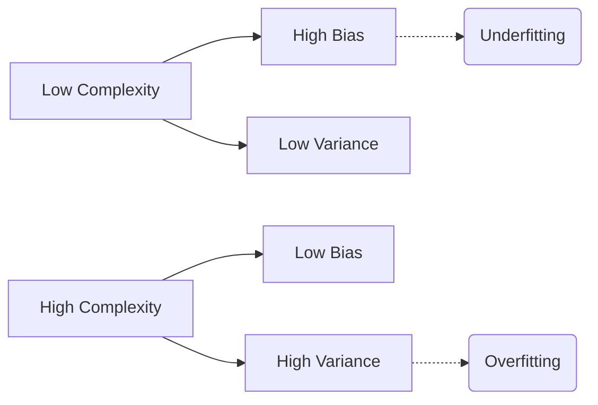

# Module IV: Regularization - Question Bank

## Q1. Explain Bias vs Variance tradeoff.

**Answer:**

The fundamental problem in machine learning is designing a model that performs well not just on the training data, but on unseen test data. The general error of a model can be broken down into Bias and Variance.

*   **Bias (Underfitting):** Bias represents the error introduced by approximating a real-world, complex problem with a heavily simplified model. High bias means the model pays very little attention to the training data and oversimplifies it. It fails to capture the underlying patterns, leading to high error on both training and test sets. (e.g., using a linear model for highly curved data).
*   **Variance (Overfitting):** Variance refers to the model's sensitivity to small fluctuations in the training data. High variance means the model pays *too much* attention to the training data, learning the noise and random anomalies along with the signal. This leads to extremely low training error, but high test error because the model doesn't generalize.

**The Tradeoff:**
*   As we increase model complexity (e.g., adding more layers/neurons in a deep neural network), bias decreases but variance increases. 
*   If we decrease complexity, variance decreases but bias increases.
*   The **Sweet Spot** is an optimal level of complexity where the total error (Bias + Variance + Irreducible Error) is minimized. Regularization techniques are used to artificially decrease variance (prevent overfitting) without substantially increasing bias.

---

## Q2. What are the different methods of regularization? Explain any four in detail.

**Answer:**

Regularization refers to any modification made to a learning algorithm that is intended to reduce its generalization error but not its training error.
Methods include: L1/L2 Regularization, Early Stopping, Dataset Augmentation, Dropout, Ensemble Methods, Injecting Noise, and Parameter Sharing.

**1. L2 Regularization (Weight Decay):**
This is the most common form of regularization. It adds a penalty term to the cost function equal to the squared magnitude of the weights.
$J_{reg}(w, b) = J(w, b) + \frac{\lambda}{2} ||w||^2$
The term $\lambda$ is the regularization hyperparameter. It forces the network to prefer smaller, diffuse weights over large, extreme weights, effectively smoothing out the function and preventing it from fitting noise.

**2. Early Stopping:**
During training, we monitor the model's performance on a separate validation set. Initially, both training and validation errors decrease. However, when the model begins to overfit, the validation error starts to rise while training error continues dropping. Early stopping simply halts the training process the moment the validation error stops improving or starts increasing. We then revert to the weights that produced the lowest validation error.

**3. Dataset Augmentation:**
The best way to make a model generalize better is to train it on more data. When actual new data is unavailable, we can artificially generate it by applying label-preserving transformations to the existing data. For images, this includes random rotations, scaling, cropping, flipping, and color shifting. This forces the model to learn invariant, robust features rather than memorizing exact pixel layouts.

**4. Dropout:**
Dropout is a computationally inexpensive but highly effective regularization method specifically for deep neural networks. During each training iteration, every neuron has a probability $p$ (e.g., 0.5) of being "dropped out" (temporarily ignored/set to zero).
This prevents complex co-adaptations where neurons rely too heavily on specific other neurons. It forces each neuron to extract useful features independently, creating a highly robust ensemble effect within a single network.

---

## Q3. What is ensembling method? Give example.

**Answer:**

**Ensembling** is a powerful technique where multiple different machine learning models (often called "weak learners") are trained independently, and their predictions are combined to produce a final, stronger prediction. The fundamental idea is that different models will make different errors, and by averaging them, the noise cancels out, drastically reducing Variance.

**Example: Random Forest**
A Random Forest is an ensemble of many Decision Trees. Instead of relying on a single, highly-overfit deep decision tree, we train hundreds of trees on random subsets of the data and random subsets of features (Bagging). For classification, the final output is determined by a majority vote among all the trees. For regression, it's the average of their outputs. In Deep Learning, training multiple identical neural networks with different random weight initializations and averaging their outputs is a common ensemble approach.

---

## Q4. What is parameter sharing and tying? Where is it observed? Give one example.

**Answer:**

**Parameter Sharing (or Tying)** is a regularization technique where instead of allowing every single weight in a network to learn a separate value, we force certain weights to share the exact same value. This drastically reduces the total number of learnable parameters, making the model much less prone to overfitting and significantly reducing memory footprint.

**Where is it observed? / Example:**
It is the core foundational principle behind **Convolutional Neural Networks (CNNs)**.
In a fully connected layer, if we process a $100\times100$ image into $10$ hidden neurons, we need $100,000$ distinct weights. 
In a CNN, we use a small filter (e.g., $3\times3$). As this filter slides across the entire image to detect a feature (like a vertical edge), the *same* 9 weights are multiplied with different patches of pixels. The weights are "shared" across spatial locations. This makes the CNN translation-invariant (it can find an edge anywhere in the image) and mathematically acts as a severe regularizer.
