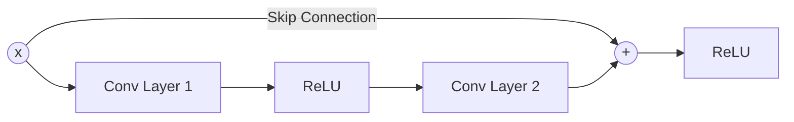

# Module V: Convolutional Neural Networks & NLP - Question Bank

## Q1. Explain the working of Convolutional Neural Networks (CNNs). Give their advantages over normal Feed Forward Neural Networks.

**Answer:**

Convolutional Neural Networks are specialized deep neural networks explicitly designed to process data with a known, grid-like topology, such as 2D image data.

**Working:**
A typical CNN consists of three main types of layers:
1.  **Convolutional Layer:** This is the core building block. It mathematically applies a convolution operation to the input. It uses learnable filters (kernels) that slide (convolve) across the spatial dimensions of the input. At each position, it computes the dot product between the filter and the local region of the input, producing a 2D activation map (feature map). This allows the network to detect features like edges, textures, and shapes.
2.  **Pooling Layer (Subsampling):** It performs a down-sampling operation along the spatial dimensions (width, height). Max Pooling is the most common, which takes the maximum value from a window (e.g., $2\times2$). This reduces the dimensionality, computational load, and memory footprint, and provides spatial variance (robustness to small translations).
3.  **Fully Connected (FC) Layer:** After several convolutional and pooling layers, the high-level reasoning is done via fully connected layers. The 2D feature maps are flattened into a 1D vector and passed through standard dense layers to output the final classification probabilities.

**Advantages over normal Feed Forward Neural Networks (MLPs):**
1.  **Parameter Sharing:** In an MLP, every input pixel is connected to every hidden neuron with a unique weight. In a CNN, a small filter (e.g., $3\times3$) shares its weights across the entire image. This drastically reduces the number of learnable parameters, preventing severe overfitting and reducing memory requirements.
2.  **Local Receptive Fields:** CNNs exploit spatial locality. A neuron in a CNN is only connected to a small, local region of the input volume. This allows it to learn local patterns (like an eye or a wheel) efficiently, whereas an MLP treats pixels far apart exactly the same as pixels close together.
3.  **Translation Invariance:** Because filters scan the entire image, a feature learned in the top-left corner can be recognized if it appears in the bottom-right corner.

---

## Q2. Give the complete formula for getting dimensions of feature map from input image/feature map.

**Answer:**

Let the input volume have spatial dimensions of size $W_{in} \times H_{in}$.
Let the Convolutional Layer have hyperparameters:
*   Filter/Kernel spatial size: $K$ (assuming a square $K \times K$ filter)
*   Stride: $S$ (the number of pixels the filter shifts over)
*   Padding: $P$ (the number of zero-pixels added to the borders of the input)

The spatial dimensions of the resulting output Feature Map ($W_{out} \times H_{out}$) are calculated using the formula:

$W_{out} = \lfloor \frac{W_{in} - K + 2P}{S} \rfloor + 1$

$H_{out} = \lfloor \frac{H_{in} - K + 2P}{S} \rfloor + 1$

*(Where $\lfloor \cdot \rfloor$ denotes the floor function, rounding down to the nearest integer).*
If the depth of the input is $D_{in}$, and the layer uses $F$ distinct filters, the final output volume will have dimensions $W_{out} \times H_{out} \times F$.

---

## Q3. Explain the Vanishing & Exploding Gradient problem. How does ResNet solve it?

**Answer:**

**The Problem:**
In very deep neural networks, gradients are calculated using the Chain Rule (multiplying derivatives backward from the output to the input layer).
*   **Vanishing Gradient:** If the activation functions (like Sigmoid or Tanh) squash their inputs into very small ranges, their derivatives are strictly less than 1. Multiplying many small numbers together causes the gradient to shrink exponentially. By the time it reaches the early layers, the gradient is practically zero. These early layers stop learning, and the network fails to converge.
*   **Exploding Gradient:** Conversely, if the weights are initialized with very large values and no normalization is applied, multiplying many numbers greater than 1 causes the gradients to grow exponentially to infinity (NaN).

**ResNet's Solution (Residual Connections):**
ResNet (Residual Networks) solves the vanishing gradient problem by introducing **Skip Connections** (or Identity Mappings). Instead of forcing a layer block to learn an underlying mapping $H(x)$, it forces it to learn a residual function $F(x) = H(x) - x$. The output becomes $F(x) + x$.
During backpropagation, the gradient can flow directly through the identity mapping '$+ x$' without passing through the non-linear activation functions. This creates "gradient superhighways," allowing the signal to travel to the earliest layers unobstructed, enabling the training of networks with hundreds of layers.

---

## Q4. What is the co-occurrence matrix word representation technique for Natural Language Processing? How is it better than the one-hot vector representation method?

**Answer:**

**Co-occurrence Matrix:**
This technique builds a massive matrix $X$ based on the statistical co-occurrence of words in a large corpus. The element $X_{ij}$ represents how many times word $i$ appears within a specific "context window" (e.g., $\pm 2$ words) of word $j$ across the entire text.
Because this raw matrix is extremely large and sparse, Singular Value Decomposition (SVD) is typically applied to reduce its dimensionality, yielding dense vectors for each word.

**Why is it better than One-Hot Representation?**

1.  **Captures Semantic Meaning:** One-hot encoding creates orthogonal vectors (dot product is always 0), meaning it assumes every word is completely independent. It cannot tell that "dog" and "cat" are related. The Co-occurrence matrix operates on the distributional hypothesis ("words that occur in the same contexts tend to have similar meanings"). Thus, the resulting vectors for "dog" and "cat" will have high cosine similarity.
2.  **Dimensionality:** If vocabulary size is $V=50,000$, one-hot vectors are 50,000-dimensional and incredibly sparse (one $1$, 49,999 $0$s). Co-occurrence matrices, especially after SVD, produce dense, low-dimensional vectors (e.g., 50 to 300 dimensions), which are vastly more efficient for deep learning models to process.
